# 摘要

鲁棒性视频水印技术是应对数字视频版权保护最有效的方法之一，但是目前基于视频帧图像的水印技术应对帧重复、帧删除、帧交换等时间同步攻击的能力有待提高。若将视频帧图像序列表示为一个三阶视频张量，那么对该三阶张量进行张量分解可以获得张量特征图，张量特征图中保存了视频帧在时间轴的相关性，是一个良好的水印嵌入载体。本文由此提出了一种基于张量特征图变换域的鲁棒视频水印算法，该算法通过将水印秘密信息嵌入在张量特征图的变换域中，在通过视频张量的重建将水印信息分散到视频张量的各个帧图像中，使水印面对时间同步攻击时具有了更强的鲁棒性。通过实验验证，本文提出的算法面对 25% 的帧重复攻击时水印 NCC 为 0.994，面对 25% 的帧删除攻击时水印 NCC 为 0.972，面对 100% 的帧交换攻击时水印 NCC 为 0.997。

**关键词：**视频水印，张量分解，时间同步攻击，鲁棒性

# 绪论

## 课题背景与意义

随着互联网尤其是移动互联网的发展与普及，通过互联网发布、分享与获取数字视频越来越便利，使得数字视频逐渐成为信息在互联网传输的主要媒介之一。但是相较于传统媒体，数字媒体信息本身具有易于复制、修改与分发的特点，导致数字媒体产品的盗版制作成本与门槛更低，进而导致侵权产品的传播更加广泛。如何在开放的互联网环境下对数字媒体产品（包括但不限于图像，音频与视频等）的版权进行保护成为了一个亟待解决的难题，而数字水印技术则是应用最广泛的解决方案。

数字水印技术作为信息隐藏技术的主要分支，已成为数字媒体信息安全的研究热点。该技术主要通过在原始载体中以一定的算法嵌入秘密信息，以证明原始载体的版权归属。嵌入的秘密信息可以是数字签名、序列号或具有特殊意义的文本与图像，载体在嵌入秘密信息后应当不影响使用，嵌入的秘密信息应当不易被察觉且不易通过压缩、裁剪与编辑等方法被删除，因此，数字水印的嵌入算法要求具有透明性与鲁棒性。

在需要对数字媒体信息的版权进行认证时，可以使用水印提取算法在载体中将秘密信息提取出来，通过秘密信息证明该数字媒体的版权归属。除了版权保护，数字水印还可应用于内容保护、内容认证、内容过滤、广播监控与在线查找等领域⸢1⸥[^1]。

而视频数字水印技术则是一种针对数字视频类型载体的数字水印⸢2⸥[^2]。虽然数字视频可以看做一组连续的帧图像序列，但是将图像数字水印算法直接应用于视频帧中往往无法达到较好的效果，这是因为相邻的的视频帧图像之间往往具有很强的相关性与冗余性，因此数字视频的主要压缩编码方案（例如 H.26X 系列⸢3-8⸥[^3]与 MPEG 系列⸢4⸥[^4]^, ​^⸢6⸥[^5]^, ​^⸢9⸥[^6]^, ​^⸢10⸥[^7]）均采用了动作预测技术与帧间压缩技术，在减小帧间的冗余信息，实现较高的压缩率的同时也会对帧图像数字水印造成较大的破坏。同时，视频水印还需要应对帧删除、帧插入等面向帧序列的特有攻击，而又不能通过无限制地提高水印的鲁棒性来应对，这会造成载体视频的质量下降，进而造成原始视频的使用价值降低。因此，设计一种同时具有较好鲁棒性与透明性的视频水印算法具有十分重要的意义。

## 研究现状

对数字水印的研究一开始集中于对数字图像水印的研究，例如 Tirkel，Charles Osborne 和 Gerard Rankin 在 1993 年提出了在灰度图像的最低有效位(Least Significant Bit, LSB)嵌入与提取水印的方案⸢12⸥[^8]，这是最早的数字水印，也是一种空间域数字水印，但是这种方案无法抵抗加噪声、缩放与滤波等常见的攻击。1995 年 Koch 等人提出了应用离散余弦变换(Discrete Cosine Transformation, DCT)的水印嵌入方案⸢13⸥[^9]，该方案是第一个变换域图像水印方案，实现了对压缩与滤波攻击的鲁棒性。1996 年 Cox⸢14⸥[^10] 与 Piva⸢15⸥[^11] 等人对 Koch 等人提出方案⸢13⸥[^9]进行改进，将水印嵌入到 DCT 变换结果的低频部分，进一步提高了水印对中值滤波、压缩与裁剪等攻击的鲁棒性。1997 年 Joseph 等人基于离散傅里叶变换(Discrete Fourier Transform, DFT)提出了一种可以抵抗旋转、尺度变换、平移等几何攻击的变换域水印方案⸢16⸥[^12]。

对视频水印的研究相较于图像与音频等其他多媒体水印技术起步较晚，但发展速度非较快。Hartung 等人于 1998 年提出了一种将视频视为图像序列，将水印调制成伪随机序列嵌入到视频帧的空间域视频水印方案⸢18⸥[^13]，与空间域图像水印一样，该方案透明性好，算法复杂度低，但面对压缩、滤波、几何变换等攻击鲁棒性较差。2001 年 Niu 等人将 DFT 引入视频水印，实现了在变换域嵌入视频水印⸢19⸥[^14]，弥补了空间域水印算法鲁棒性较差的缺点。后来 Liu 等人在傅里叶变换域使用统计方法实现了水印的嵌入，提出了一种可用于视频压缩域的高容量鲁棒性视频水印算法⸢20⸥[^15]。

近年来，由于在视频图像帧变换域的水印嵌入方案通常对帧攻击的鲁棒性表现不佳，因此出现了一些将秘密信息嵌入到视频时间域的视频水印算法。例如 Li 等人提出了一种基于三维小波变换的视频水印算法⸢21⸥[^16]，该算法分别在帧图像空间域进行二维小波变换，在帧图像的时间域进行一维小波变换，从而将水印信息同时嵌入到了变换结果的高频系数与低频系数中，实现了对帧平均与帧删除等攻击的鲁棒性。

由上述研究成果可知，鲁棒性视频水印不仅需要面对针对传统图像水印的攻击（例如裁剪、旋转、缩放等几何变换攻击，噪声、滤波、直方图均衡等信号处理攻击），还需要面对针对视频的特有攻击（例如帧重复、帧删除、帧插入、帧交换等时间同步攻击，视频压缩攻击、视频重压缩攻击等压缩编码攻击），因此对可以兼顾透明性的优秀鲁棒性视频水印算法的研究具有非常重要的理论与实际意义。

## 本文研究内容

为了充分利用视频帧图像内的空间冗余性与视频帧之间的时间冗余性，本文使用三维张量表示一组视频帧序列，该三维张量可通过 Tucker 分解获得对应的核心张量与三个因子矩阵，通过对核心张量与三个因子矩阵的特性进行研究，通过设计合适的水印嵌入方案将秘密信息嵌入核心张量与因子矩阵，进而将水印信息均匀分散到视频张量的各个帧中，在兼顾透明性的同时提高视频水印针对常见视频攻击的鲁棒性。

# 视频水印分类与评价标准

## 视频水印分类

视频水印算法可以根据水印属性（嵌入容量、透明性与钼棒性）、嵌入方法（基于内容、基于码流）与提取方法三个大维度六个小维度进行分类，如图1所示。

* 视频水印

  * 基于水印属性

    * 基于嵌入容量

      * 零水印
      * 非零水印
    * 基于透明性

      * 可见水印
      * 非可见水印
    * 基于鲁棒性

      * 脆弱水印
      * 半脆弱水印
      * 鲁棒水印
  * 基于嵌入方法

    * 基于内容

      * 空间域水印
      * 变换域水印
      * 时间域水印
    * 基于码流

      * H.26X
      * MPEG
      * AV1
  * 基于提取方法

    * 盲提取水印
    * 半盲提取水印
    * 非盲提取水印

零水印与非零水印的主要区别为是否修改了视频载体。零水印仅提取视频特征作为水印，不在视频载体中嵌入任何秘密信息，因此不会更改原视频载体；非零水印则会通过修改原视频载体将秘密信息嵌入，会造成视频比特流增加或者视频质量降低。

可见水印与不可见水印的主要区别是人类能否察觉视频中嵌入的水印。可见水印由于能够被人类观察者察觉，因此较易通过裁剪、遮挡等方法删除。不可见水印则会将秘密信息以人类无法察觉的方式添加到载体视频中，因此安全性更高。

脆弱、半脆弱与鲁棒性水印的主要区别是删除/破坏视频中水印的难度。脆弱水印较容易在视频载体再次编辑时被破坏，半脆弱水印能较好地抵抗无意的信号处理（例如常见的转码，压缩等视频处理）但会被有意的视频篡改篡改所破坏，因此两者通常作为认证水印用于验证原视频载体的真实性；含有鲁棒性水印的视频在受到无意或有意的攻击后依然可以成功提取其中的秘密信息，因此通常作为版权水印用于验证视频的版权所有者。

空间域、变换域及时间域水印的主要区别是水印嵌入的位置。空间域水印是通过直接修改视频帧的像素的方式将秘密信息嵌入；变换域水印会在水印嵌入前对视频帧进行变换，通过修改变换结果的值将秘密信息嵌入，之后进行反变换重建视频帧；时间域水印则是将秘密信息分散嵌入在不同的视频帧中。

基于码流的数字水印又称为压缩域数字水印，其主要的区别是适用于不同的压缩编码方案。目前常用的压缩编码方案主要有 H.164/AVC、H.265/HEVC 两种，此外还有 AV1 等方案。这些数字水印方案一般在嵌入水印时无需解压解码视频，嵌入后也无需重新压缩编码，因此在满足鲁棒性的同时还具有较快的处理速度。

盲提取、半盲提取与非盲提取水印的主要区别是在提取水印时是否需要额外的信息。非盲提取水印在提取水印时需要使用未嵌入水印的原始视频；半盲提取水印需要原始水印信息或者其他额外的信息；盲提取水印只需要含水印的视频即可进行水印的提取。

## 视频水印评价标准

对于一个水印系统，同时存在嵌入容量，透明性与鲁棒性三个相互制衡的衡量标准⸢11⸥[^17]：嵌入容量是指一个视频载体中可嵌入秘密信息的长度，可嵌入秘密信息的长度越长，嵌入容量越大；透明性由视频载体在嵌入秘密信息前后的相似程度衡量，透明度越高的水印对于人类观察者而言就越难以察觉；鲁棒性则指水印算法抵抗攻击的能力，鲁棒性越高的水印算法在攻击后提取水印的成功率越高。对于某一具体的水印算法：若需要较高的透明性，就需要减少对载体视频的修改，这会降低嵌入容量与水印鲁棒性；若需要较高的鲁棒性，可以通过增大嵌入的量化强度或者通过编码技术嵌入额外的冗余信息，但这分别会降低水印的透明度与水印的嵌入容量。因此，一般需要针对该水印的实际用途在这三者之间做出取舍，例如用于版权保护的水印需要较高的鲁棒性，用于内容注释的水印需要更关注较高的嵌入容量，用于医学信息的水印对透明性的要求更高。下面我将分别介绍透明性与鲁棒性的客观评价标准

### 透明性评估标准

对于数字水印通常使用平均误差均值(Mean Square Error, MSE)与峰值信噪比(Peak Signal to Noise Ration, PSNR)作为水印透明性的客观衡量标准。MSE 表示视频图像帧在嵌入水印前后的误差，通常情况下 MSE 值越大说明嵌入水印造成的视频失真程度就越大，其计算公式为：

$$
\begin{equation}
    MSE = \dfrac{1}{MN} \sum_{i = 1}^{M} \sum_{j=1}^{N} | I(i, j) - I'(i, j) |^2
\end{equation}
$$

其中 $M$ 表示视频帧图像的高度，$N$ 表示视频帧图像的宽度，$I$ 表示原始视频帧图像，$I'$ 表示嵌入水印后的视频帧图像，$I(i, j)$ 与 $I'(i, j)$ 分别表示原始视频帧图像与嵌入水印后的视频帧图像中的一个像素值。

PSNR 值可以由 MSE 值快速计算，通常情况下 PSNR 值越大说明嵌入水印造成的视频失真程度越小，一般来说 $PSNR \ge 40$ 的数字水印不会造成视频质量的明显下降，PSNR 的计算公式为：

$$
\begin{equation}
\begin{aligned}
PSNR
    &= 10 \log_{10}(\dfrac{255^2}{MSE}) \\
    &= 10 \log_{10}(\dfrac{255^2 \cdot MN}{\sum\limits_{i = 1}^{M} \sum\limits_{j=1}^{N} | I(i, j) - I'(i, j) |^2}) \\
\end{aligned}
\end{equation}
$$

### 鲁棒性评估标准

对于数字水印通常使用误比特率(Bit Error Ratio, BER)与归一化互相关系数(Normalized Cross Correlation, NCC)作为水印鲁棒性的客观衡量标准。BER 表示提取的水印信息中错误的比特位数占水印总比特位数的比例，适用于嵌入的水印为二值图像或者比特序列的情况，通常情况下 BER 值越大说明攻击对水印造成的破坏程度越低，即水印算法的鲁棒性越强，其计算公式为：

$$
\begin{equation}
    BER = \dfrac{\sum\limits_{i=1}^{m} \sum\limits_{j=1}^{n} |B'(i, j) - B(i, j)|}{m \cdot n}
\end{equation}
$$

其中 $m$ 表示二值水印图像的高度，$n$ 表示二值水印图像的宽度，$B$ 表示嵌入的水印二值图像，$B'$ 表示提取的水印二值图像，$B(i, j)$ 与 $B'(i, j)$ 分别表示嵌入的水印二值图像与提取的水印二值图像中的一个像素值，可能为 $0$ 或者为 $1$​。

若嵌入的水印图像是一个灰度图像或者多个颜色通道的彩色图像，则需要使用 NCC 值来量化提取的水印图像与原始的水印图像之间的相似程度，通常情况下 NC 值越大表示攻击对水印的破坏程度越低，即水印算法的鲁棒性越强，其计算公式为：

$$
\begin{equation}
    NCC = \dfrac{
        \sum\limits_{i=1}^{m} \sum\limits_{j=1}^{n}\big(B'(i, j) \times B(i, j)\big)
    }{
        \sqrt{\sum\limits_{i=1}^{m} \sum\limits_{j=1}^{n}\big(B'(i, j)\big)^2}
        \times
        \sqrt{\sum\limits_{i=1}^{m} \sum\limits_{j=1}^{n}\big(B(i, j)\big)^2}
    }
\end{equation}
$$

# 张量与张量计算概述

## 张量 (Tensor)

张量是一种多维数据表现形式，张量中数据的维度称之为张量的阶，一阶张量可以称为向量，二阶张量可以称为矩阵，三阶及三阶以上的张量称之为高阶张量，因此我们可以将张量理解为高阶向量或高阶矩阵。

在本文中使用三阶张量 $\mathcal{A} \in \mathbb{R}^{I_1 \times I_2 \times I_3}$ 表示一组灰度视频帧序列，这里张量的三个维度分别表示视频的高度 $I_1$、视频的宽度 $I_2$ 与视频帧数 $I_3$。

## 张量的纤维 (Fiber)

张量的纤维可以类比为矩阵的行或者列，表示保留 $n$ 阶张量 1 个维度、固定其他 $(n-1)$ 个维度时从张量中抽取的向量。假设三阶张量为 $\mathcal{X} \in \mathbb{R}^{I_1 \times I_2 \times I_3}$，若保留三阶张量第 1 个维度，固定张量第 2、3 维度抽取的纤维称之为列纤维 (column fiber) 或者模态-1 纤维 (Mode-1 fiber)，使用 $x_{:jk}$ 表示；若保留三阶张量第 2 个维度，固定张量第 1、3 维度抽取的纤维称之为行纤维 (row fiber) 或者模态-2 纤维 (Mode-2 fiber)，使用 $x_{i:k}$ 表示；若保留三阶张量第 3 个维度，固定张量第 1、2 维度抽取的纤维称之为管纤维 (tube fiber) 或者模态-3 纤维 (Mode-3 fiber)，使用 $x_{ij:}$ 表示。

​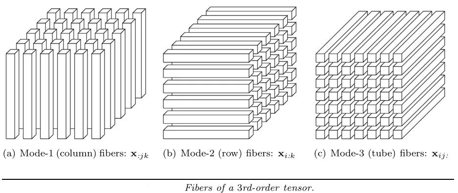​

## 张量的切片 (Slice)

张量的切片类似于张量的纤维，表示保留 $n$ 阶张量 2 个维度、固定其他 $(n-2)$ 个维度时从张量中抽取的矩阵。假设三阶张量为 $\mathcal{X} \in \mathbb{R}^{I_1 \times I_2 \times I_3}$，若保留三阶张量第 2、3 个维度，固定张量第 1 维度抽取的切片称之为水平切片 (horizontal slice)，使用 $X_{i::}$ 表示；若保留三阶张量第 1、3 个维度，固定张量第 2 维度抽取的切片称之为侧面切片 (lateral slice)，使用 $X_{:j:}$ 表示；若保留三阶张量第 3 个维度，固定张量第1、2维度抽取的切片称之为正面切片 (frontal slice)，使用 $X_{::k}$ 表示。

​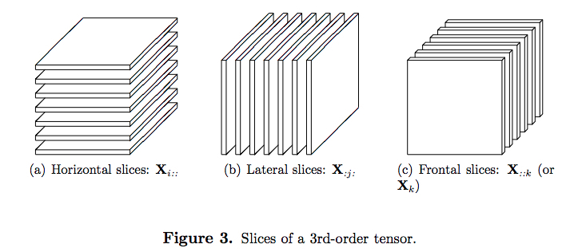​

## 张量的展开 (Unfolding)

张量的展开又称为张量的矩阵化 (Matricization)，描述将张量沿某一个维度转化为矩阵的方式，展开后的张量可以更加方便的进行矩阵化运算。展开后的矩阵还可还原为高阶张量 (Folding)。假设三阶张量为 $\mathcal{X} \in \mathbb{R}^{I_1 \times I_2 \times I_3}$，若将三阶张量沿第 1 个维度（模态 1, mode-1）展开可以得到 $\mathcal{X}_{(1)} = \left[ X_{:,:,1}, X_{:,:,2}, \cdots, X_{:,:,I_3} \right]$；若将三阶张量沿第 2 个维度（模态-2, mode-2）展开可以得到 $\mathcal{X}_{(2)} = \left[ X_{:,:,1}^T, X_{:,:,2}^T, \cdots, X_{:,:,I_3}^T \right]$；若将三阶张量沿第 3 个维度（模态-3, mode-3）展开可以得到 $\mathcal{X}_{(3)} = \left[ X_{:,1,:}^T, X_{:,2,:}^T, \cdots, X_{:,I_2,:}^T \right]$。

​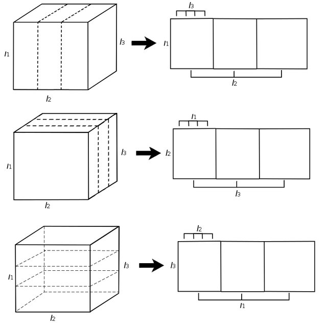​

## 张量的模态积 (Modal Product)

张量的模态积描述张量与矩阵相乘的运算方式，假设存在一个大小为 $(I_1 \times \cdots \times I_n \times \cdots \times I_N)$ 的 $N$ 阶张量 $\mathcal{X} \in \mathbb{R}^{I_1 \times \cdots \times I_n \times \cdots \times I_N}$ 与一个大小为 $(J \times I_n)$ 的矩阵 $A \in \mathbb{R}^{J \times I_n}$，则张量 $\mathcal{X}$ 与矩阵 $A$ 的 $n$ 模态积为：

$$
\begin{equation}
(\mathcal{X} \times_n A)_{i_1 \cdots i_{n-1} j i_{n+1} \cdots i_N}
    = \sum_{i_n = 1}^{I_n} x_{i_1 \cdots i_N} a_{j i_n}
\end{equation}
$$

其中模态积的运算结果 $\mathcal{Y} = (\mathcal{X} \times_n A) \in \mathbb{R}^{I_1 \times \cdots \times I_{n-1} \times J \times I_{n+1} \times \cdots \times I_N}$ 满足 $\mathcal{Y}_{(n)} = A \mathcal{X}_{(n)}$，可以视为 $\mathcal{X}$ 中所有模态-1 的纤维与矩阵 $A$ 的点乘。

## 张量的 Tucker 分解

Tucker 于 1966 年提出了 Tucker 分解的三种方案，其中一种分解方法是由矩阵的奇异值分解泛化而来⸢22⸥[^18]，下面将分别介绍矩阵的奇异值分解，张量的高阶奇异值分解。

### 奇异值分解 (Singular Value Decomposition, SVD)

给定一个大小为 $(m \times n)$ 的矩阵 $A \in \mathbb{R}^{m \times n}$，该矩阵的奇异值分解结果为：

$$
\begin{equation}
    A = U \Sigma V^T
\end{equation}
$$

其中，矩阵 $U \in \mathbb{R}^{m \times m}$ 由左奇异向量 (left sigular vector) 构成，矩阵 $\Sigma \in \mathbb{R}^{m \times n}$ 的对角线上的元素称为奇异值 (singular value)，矩阵 $V \in \mathbb{R}^{n \times n}$ 由右奇异向量 (right sigular vector) 构成。

### 高阶奇异值分解 (Higher-Order Singular Value Decomposition, HOSVD)

给定一个大小为 $(I_1 \times I_2 \times \cdots \times I_N)$ 的张量 $\mathcal{X} \in \mathbb{R}^{I_1 \times I_2 \times \cdots \times I_N}$，该张量在模态 $n$ 下展开为矩阵 $\mathcal{X}_{(n)}$，对该矩阵进行奇异值分解：

$$
\begin{equation}
    \mathcal{X}_{(n)} = U_n \Sigma_n V_n^T \quad n = 1, 2, \cdots, N
\end{equation}
$$

其中，矩阵 $U_n \in \mathbb{R}^{I_n \times I_n}$，矩阵 $\Sigma \in \mathbb{R}^{I_n \times (I_1 I_2 \cdots I_{n-1} I_{n+1} \cdots I_N)}$ 与矩阵 $V \in \mathbb{R}^{(I_1 I_2 \cdots I_{n-1} I_{n+1} \cdots I_N) \times (I_1 I_2 \cdots I_{n-1} I_{n+1} \cdots I_N)}$ 分别是矩阵 $\mathcal{X}_{(n)}$ 进行奇异值分解得到的，取出左奇异向量组成的矩阵 $U_1, U_2, \cdots, U_N$，可以计算张量的高阶奇异值分解结果：

$$
\begin{equation}
\begin{cases}
    \mathcal{X} &= \mathcal{G} \times_1 U_1 \times_2 U_2 \cdots  \times_N U_N \\
    \mathcal{G} &= \mathcal{X} \times_1 U_1^T \times_2 U_2^T \cdots  \times_N U_N^T \\
\end{cases}
\end{equation}
$$

其中 $\mathcal{G} \in \mathbb{R}^{I_1 \times I_2 \times \cdots \times I_N}$ 称为核心张量，矩阵 $U_1, U_2, \cdots, U_N$ 的大小分别为 $(I_1 \times I_1),(I_2 \times I_2), \cdots, (I_N \times I_N)$

# 基于张量特征的鲁棒性视频水印

本文算法的实现与算法性能测试实验数据可从 [https://github.com/Zuoqiu-Yingyi/video-watermark](https://github.com/Zuoqiu-Yingyi/video-watermark) 中获取。

## 算法原理

本文中使用三阶张量 $\mathcal{A} \in \mathbb{R}^{I_1 \times I_2 \times I_3}$ 表示一组相邻的灰度视频片段帧序列，对该张量进行 Tucker 分解可以得到该张量的核心张量 $\mathcal{S}$：

$$
\begin{equation}
\begin{cases}
    \mathcal{A} &= \mathcal{S} \times_1 U_1 \times_2 U_2 \times_3 U_3 \\
    \mathcal{S} &= \mathcal{A} \times_1 U_1^T \times_2 U_2^T \times_3 U_3^T \\
\end{cases}
\end{equation}
$$

通过核心张量 $\mathcal{S}$ 可以计算包含不同帧帧内与帧间信息的特征张量 $\zeta$：

$$
\begin{equation}
\begin{cases}
    \mathcal{A} &= \zeta \times_3 U_3 \\
    \zeta &= \mathcal{S} \times_1 U_1 \times_2 U_2 &= \mathcal{A} \times_3 U_3^T \\
\end{cases}
\end{equation}
$$

若 $A_{::k}$ 表示 $\mathcal{A}$ 的正向切片，即灰度视频片段张量的第 $k$ 帧，则 $\zeta_{::k}$ 表示特征张量 $\zeta$ 的第 $k$ 特征图，尺寸与视频帧一致，且满足：

$$
\begin{equation}
    \|\zeta_{::1}\|^2 \ge \|\zeta_{::2}\|^2 \ge \cdots \ge  \|\zeta_{::I_N}\|^2
\end{equation}
$$

其中 $\|\zeta_{::k}\| = \sqrt{\sum\limits_{i=1}^{I_1} \sum\limits_{j=1}^{I_2} |\zeta_{ijk}|^2}$ 表示第 $i$ 特征图 $\zeta_{::k}$ 的 Frobenius 范数，可以看出，特征张量 $\zeta$ 的第 $1$ 特征图 $\zeta_{::1}$ 包含了主要该视频张量对应视频片段的主要信息⸢23⸥[^19]，称之为张量特征图 $F$，如下所示：

​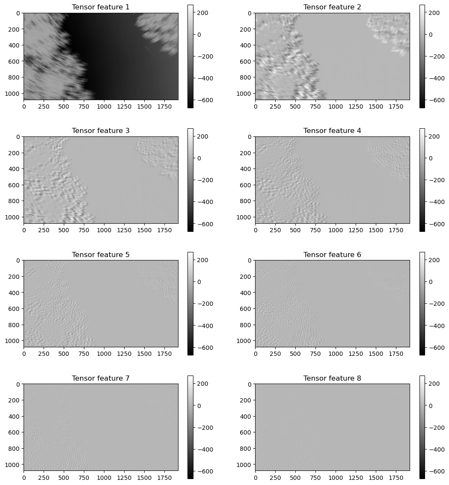​

若在张量特征图 $F$ 中嵌入变换域图像数字水印，并使用嵌入水印后的张量特征图 $F'$ 重建视频张量 $\mathcal{A'}$，那么水印将分散在整个视频帧序列中，具有了抵抗帧重复、帧删除、帧插入、帧交换等时间同步攻击的能力。

## 算法流程

### 水印嵌入流程

假设载体视频 $V$ 的分辨率为 $M \times N$，水印图像 $B$ 尺寸为为 $m \times n$，水印嵌入流程如下：

1. 水印图像缩放。根据载体视频的分辨率，计算载体的嵌入容量，并根据嵌入容量将水印图像灰度化后并将其尺寸缩放至 $m' \times n'$，获得 $B'$。
2. 水印图像置乱。使用 Otsu 算法将缩放后的灰度水印图片 $B'$ 二值化，并使用混沌序列对水印图像进行置乱，获得 $B'$。
3. 计算视频所有相邻帧之间的相似度。计算视频所有前后相邻的帧图像之间的相似度（帧间相似度）：

    $$
    \begin{equation}
    r = \dfrac{
            \sum\limits_{i=1}^M
            \sum\limits_{j=1}^N
            \big(X(i, j) - \bar{X}\big)
            \big(Y(i, j) - \bar{Y}\big)
        }{
            \sqrt{
                \Big(
                    \sum\limits_{i=1}^M
                    \sum\limits_{j=1}^N
                    \big(X(i, j) - \bar{X}\big)^2
                \Big)
                \Big(
                    \sum\limits_{i=1}^M
                    \sum\limits_{j=1}^N
                    \big(Y(i, j) - \bar{Y}\big)^2
                \Big)
            }
        }
    \end{equation}
    $$

    其中 $X, Y$ 表示视频前后相邻的帧图像，其像素均值分别为 $\bar{X}, \bar{Y}$。
4. 通过帧间相似度的阈值分割不同场景的视频。设置帧间相似度阈值 $ST$，若 $r \ge ST$，则说明相邻的两帧处于同一场景。
5. 构造视频张量。截取处于同一场景的相邻的连续 $K$ 帧图像，构造视频张量 $\mathcal{A} \in \mathbb{R}^{M \times N \times K}$。
6. 计算视频张量的特征张量。对视频张量 $\mathcal{A}$ 进行 Tucker 分解，获得模态 3 的因子 $U_3$，并计算特征张量 $\zeta = \mathcal{A} \times_3 U_3^T$。
7. 获取张量特征图。截取特征张量 $\zeta$ 的第一个正向切片 $F$ 作为张量特征图。
8. 获取 LL 子带。对张量特征图 $F$ 进行一级 Haar 小波变换，并截取变换结果的 LL 子带。
9. 获取分块 DCT 系数矩阵。将 LL 子带划分为 $8 \times 8$ 大小的非重叠子块，并对每个子块进行 DCT 变换，获得每个子块的 DCT 系数矩阵。
10. 修改 DCT 系数矩阵的中频系数。在第 $i$ 行第 $j$ 列的子块的 DCT 系数矩阵中选取一个中频系数 $y_{i, j}(u, v)$，并计算该系数 Zig-Zag 排序相邻的的 6 个系数的均值 $arg_{i, j}$，之后根据置乱后的水印图像 $B''$ 修改所选取的中频系数 $y_{i, j}(u, v)$：

     $$
     \begin{equation}
     y_{i, j}'(u, v) =
     \begin{cases}
         avg_{i, j} + Q, \qquad B''(i, j) = 1 \\
         avg_{i, j} - Q, \qquad B''(i, j) = 0 \\
     \end{cases}
     \end{equation}
     $$

     其中 $1 \le i \le m,\ 1 \le j \le n$，$Q$ 为量化强度，$Q$ 越大水印鲁棒性越好但透明性越差。  
     ​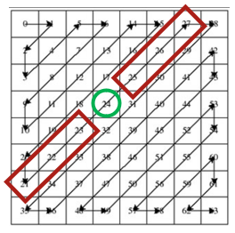​
11. 重建 LL 子带。对每个 DCT 系数矩阵进行 IDCT，获得嵌入水印后的 LL 子带。
12. 重建张量特征图。使用嵌入水印后的 LL 子带替换原 LL 子带，并进行 IDWT，获得嵌入水印后的张量特征图 $F'$。
13. 重建视频张量。使用嵌入水印的张量特征图 $F'$ 替换特征张量的第一个正向切片，获得嵌入水印的特征张量 $\zeta'$，并计算嵌入水印后的视频张量 $\mathcal{A'} = \zeta' \times_3 U_3$。
14. 重建视频。使用含水印的视频张量表示的视频帧序列替换原始的视频帧，选取下一组同场景的视频帧序列重复步骤 5。

### 水印提取流程

假设含水印视频 $V'$ 的分辨率为 $M \times N$，水印图像 $B$ 尺寸为为 $m \times n$，水印提取流程如下：

1. 获得同场景的一组视频帧序列。通过帧间相似度对视频进行场景分割，选择其中一组同场景的视频帧序列。
2. 构造视频张量。截取处于同一场景的相邻的连续 $K$ 帧图像，构造视频张量 $\mathcal{A'} \in \mathbb{R}^{M \times N \times K}$。
3. 计算视频张量的特征张量。对视频张量 $\mathcal{A'}$ 进行 Tucker 分解，获得模态 3 的因子 $U_3'$，并计算特征张量 $\zeta' = \mathcal{A'} \times_3 U_3^{'T}$。
4. 获取张量特征图。截取特征张量 $\zeta'$ 的第一个正向切片 $F'$ 作为张量特征图。
5. 获取 LL 子带。对张量特征图 $F$ 进行一级 Haar 小波变换，并截取变换结果的 LL 子带。
6. 获取分块 DCT 系数矩阵。将 LL 子带划分为 $8 \times 8$ 大小的非重叠子块，并对每个子块进行 DCT 变换，获得每个子块的 DCT 系数矩阵。
7. 在每个子块的 DCT 系数矩阵中提取水印信息。

    $$
    \begin{equation}
    B'(i, j) =
    \begin{cases}
        1, \qquad y'_{i, j}(u, v) > avg'_{i, j}\\
        0, \qquad y'_{i, j}(u, v) \le avg'_{i, j}\\
    \end{cases}
    \end{equation}
    $$

## 算法性能测试

算法性能测试所使用的载体视频为 Xiph.org Video Test Media ([https://media.xiph.org/video/derf/](https://media.xiph.org/video/derf/)) 中的 blue_sky，该视频宽高比为 16:9，分辨率为 $1920 \times 1080$，共 217 帧。

算法性能测试所使用的水印原始图片为东南大学校标 ([https://www.seu.edu.cn/2017/0531/c28443a332468/page.htm](https://www.seu.edu.cn/2017/0531/c28443a332468/page.htm))，宽高比为 1:1，分辨率为 $4726 \times 4726$。

算法性能测试中实际嵌入的二值图片水印宽高比为 1:1，分辨率为 $90 \times 90$。

​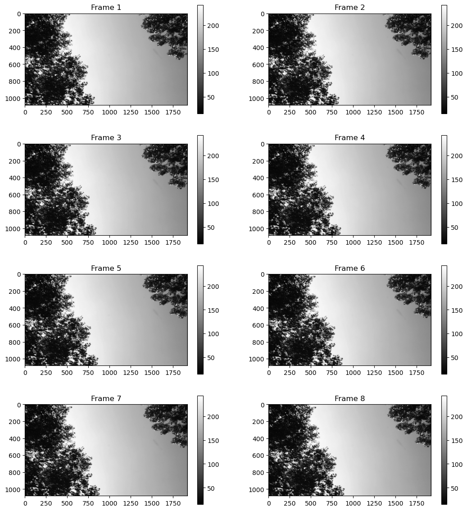​

​​

​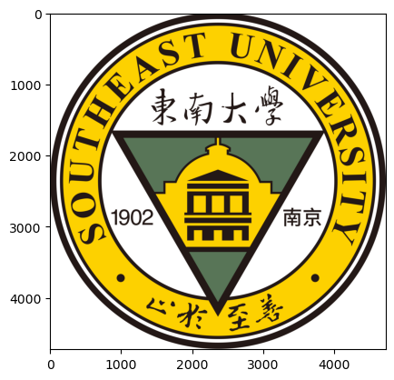

### 算法参数取值

本次算法性能测试中使用视频帧在嵌入水印前后 PSNR 评估算法的透明度，使用受攻击后提取的水印 BER 评估算法的鲁棒性。

为了寻找视频张量第三维度尺寸 $K$ 与算法透明度的关系，需要通过实验的方式选择一个合适的 $K$ 值，这里量化强度取 $Q = 32$。

​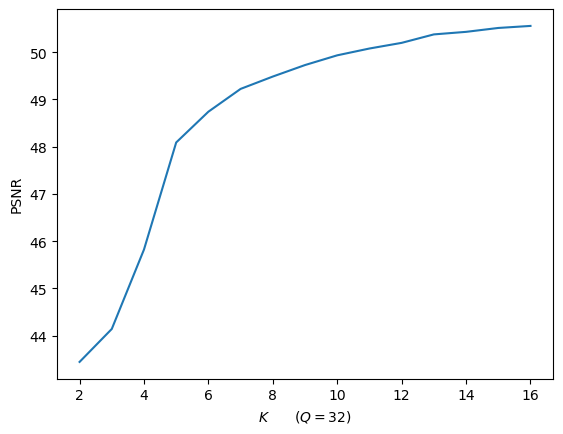​

为了兼容算法效率与透明度，实验使用相邻的 8 个视频帧构建一个视频张量，即 $K = 8$。

由于量化强度 $Q$ 越大时水印鲁棒性越好但水印透明性越差，因此需要通过实验选取一个可以平衡水印透明性与鲁棒性的量化强度。下图表示算法不被攻击的情况下量化强度 $Q$ 分别与视频帧 PSNR 值、视频帧 NC 值与水印 BER 值的关系。

​ 量化强度 Q 与帧图片 PSNR 的关系 (b) 量化强度 Q 与水印 BER 的关系")​

由图可以看出，当 $Q \ge 22$ 时可以保证水印未遭受攻击时 $BER = 0$，即可以完整提取水印。不过为了综合考虑算法的透明度与鲁棒性，这里取 $Q = 40$，此时 $PSNR > 48$，可以保证人类难以察觉视频嵌入了水印。

算法参数如表 1 所示：

算法参数

|算法参数|算法参数值|说明|
| ----------| ------------| ------------------------------------|
|$M$​|$1080$​|视频高度（视频张量第一维度尺寸）|
|$N$​|$1920$​|视频宽度（视频张量第二维度尺寸）|
|$K$ |$8$​|视频帧数（视频张量第三维度尺寸）|
|$Q$​|$40$|水印量化强度|
|$m$​|$90$​|水印高度|
|$n$​|$90$​|水印宽度|
|$ST$​|$0.8$​|场景分割阈值|
|$(u, v)$​|$(4, 4)$​|水印嵌入中频系数位置|
|$x$ |$0.123$​|混沌序列迭代器初值|
|$X$​|$0.5$​|混沌序列阈值（用于转换为比特序列）|

### 水印透明性

当 $Q = 40$ 时嵌入水印后的载体视频帧图像的 PSNR 如下图所示：

​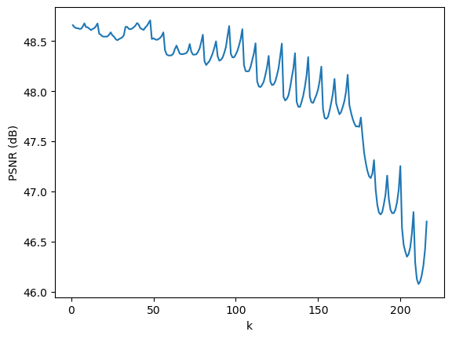

图中横坐标为帧序号，纵坐标为 PSNR 值，可以看出整个视频的 PSNR 稳定在 46dB ~ 49dB 之间，说明人类观察者难以察觉嵌入水印后的视频与原始视频之间的差异。

### 水印鲁棒性

#### 几何变换攻击

##### 裁减攻击

图中横坐标为裁剪的列数，由于本文水印使用 DWT-DCT 方案嵌入在张量特征图中，因此其抵抗裁剪攻击的能力与裁剪尺寸与 DCT 分块变换的窗口大小有关。实验中窗口为 8×8，因此其裁剪的列数为 8 的整数倍时水印抵抗能力较强。但是由于用于解码的混沌序列无法与裁剪后视频中提取的水印同步，因此裁剪列数过多时水印将被破坏。

​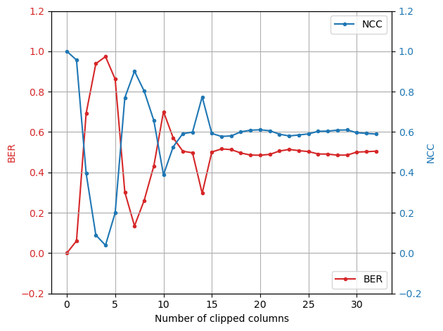​

##### 缩放攻击

图中横坐标表示将含水印视频尺寸缩放至原视频的倍数，若缩放倍数为 0.5 则表示缩放后的视频宽高均为原视频的一半。从图中可以看出，本方案具有较好的抵抗缩放攻击的能力，视频尺寸缩放至原来的 0.3 倍时提取的水印误比特率也仅为 9.19%。

​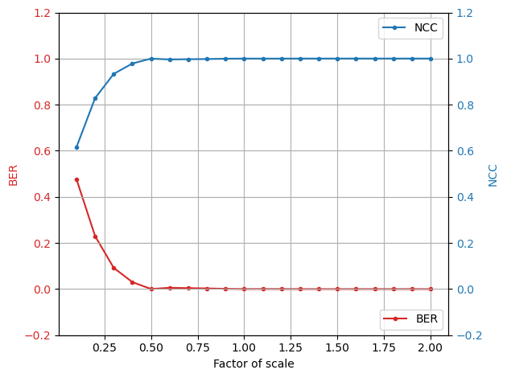

#### 信号处理攻击

##### 高斯噪声攻击

图中横坐标为高斯噪声的方差，高斯噪声的均值取 0。从图中可以看出，本方案具有较好的抵抗高斯噪声攻击的能力，添加方差为 0.02 的高斯噪声，提取的水印误比特率为 24.5%。

​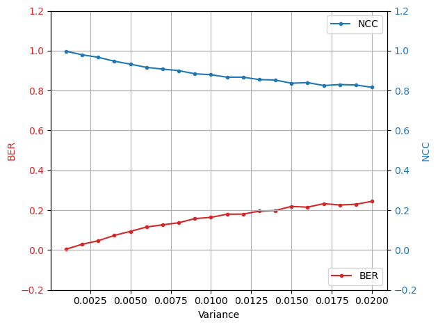​

##### 椒盐噪声攻击

图中横坐标为所添加椒盐噪声的比例。从图中可以看出，本方案具有较好的抵抗椒盐噪声攻击的能力，添加比例为 5% 的椒盐噪声，提取的水印误比特率为 22.2%。

​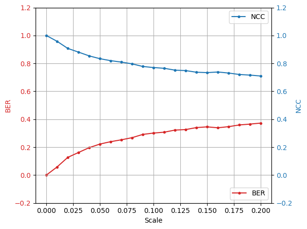​

##### 均值滤波攻击

从图中可以看出，本方案具有较好的抵抗均值滤波攻击的能力，当使用窗口为 3×3 的均值滤波器进行滤波攻击时，提取的水印误比特率仅为 1.4%。

​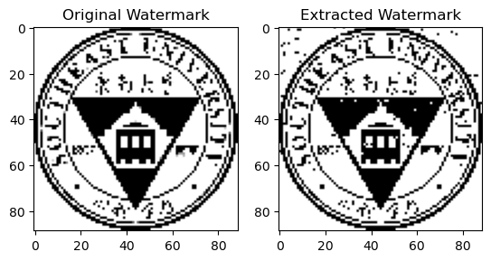​

##### 中值滤波攻击

从图中可以看出，本方案具有较好的抵抗中值滤波攻击的能力，当使用窗口为 3×3 的中值滤波器进行滤波攻击时，提取的水印误比特率仅为 0.5%。

​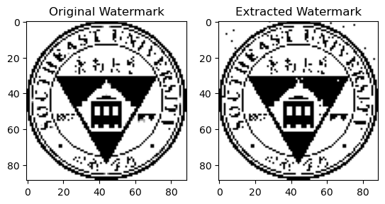​

##### 直方图均衡攻击

从图中可以看出，本方案具有较好的抵抗直方图均衡攻击的能力，提取的水印误比特率仅为 1.3%。

​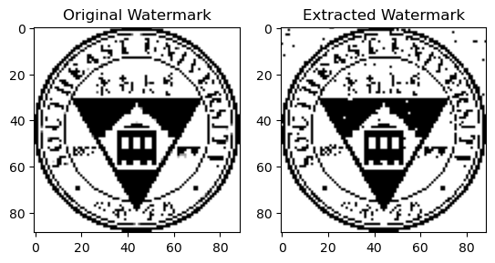​

#### 时间同步攻击

##### 帧重复攻击

图中横坐标为测试视频片段中重复帧所占比例。从图中可以看出，本方案具有较好的抵抗帧重复攻击的能力，即时测试视频片段中所有的帧均为重复帧，所提取的水印误比特率也仅为 9.2%。

​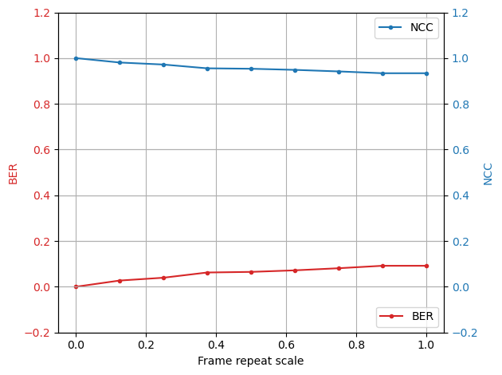​

##### 帧删除攻击

图中横坐标为测试视频片段中删除的帧所占比例。从图中可以看出，本方案具有较好的抵抗帧删除攻击的能力，即时测试视频片段 8 帧中删除了其中的 7 帧，所提取的水印误比特率也仅为 8.7%。

​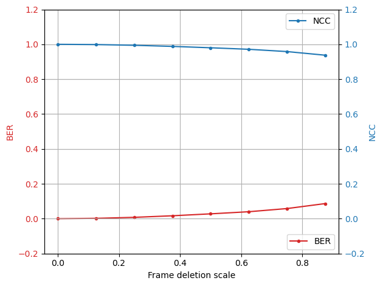​

##### 帧插入攻击

图中横坐标为测试视频片段中插入的帧所占比例。从图中可以看出，本方案具有较好的抵抗帧删插入攻击的能力，即时测试视频片段中所有的帧均为插入的帧，所提取的水印误比特率也仅为 9.2%。

​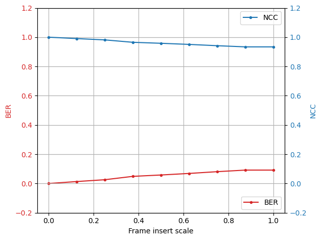​

##### 帧交换攻击

从图中可以看出，本方案具有较好的抵抗帧交换攻击的能力，将视频中所有相邻的两帧进行交换，提取的水印误比特率也仅为 0.4%。

​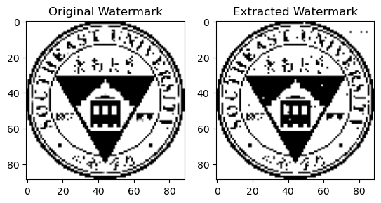​

## 基于内容的视频水印性能对比分析

| |文献⸢24⸥[^20]|文献⸢25⸥[^21]|文献⸢26⸥[^22]|文献⸢27⸥[^23]|文献⸢28⸥[^24]|本文|本文|
| ----------------| ---------------| ---------------| ---------------| ---------------| ---------------| --------------| --------------|
|嵌入方法|DWT|DWT|DWT|DWT-SVD|DT-CWT|DWT-DCT|DWT-DCT|
|鲁棒性评价指标|NCC|BER|NCC|NCC|NCC|BER|NCC|
|PSNR/dB|45|58|98.741|73.582|44.53|48.64|48.64|
|直方图均衡化|0.99|N/A|0.962|N/A|N/A|0.013|0.991|
|均值滤波|0.93 [N/A]|N/A|N/A|1 [3×3]|N/A|0.014|0.990|
|高斯噪声|0.95 [N/A]|0.0005 [N/A]|1 [0.01]|0.992 [0.01]|N/A|0.164 [0.01]|0.879 [0.01]|
|椒盐噪声|0.99 [N/A]|N/A|0.949 [0.009]|0.99 [0.01]|N/A|0.058 [0.01]|0.958 [0.01]|
|裁剪|0.98|N/A|N/A|N/A|N/A|0.060|0.957|
|缩放|0.87 [N/A]|N/A|N/A|0.003 [1.2]|0.99 [1.5]|0.003 [1.25]|0.998 [1.25]|
|帧删除|N/A|0.004 [20%]|N/A|0.918 [20%]|N/A|0.008 [25%]|0.994 [25%]|
|帧重复|N/A|N/A|N/A|0.912 [20%]|N/A|0.040 [25%]|0.972 [25%]|
|帧交换|N/A|N/A|N/A|0.931 [20%]|N/A|0.004 [100%]|0.997 [100%]|

从表中可以看出，由于视频张量在水印嵌入过程中进行 Tucker 分解与重建时存在一定的精度损失，因此本文算法的透明度仅略高于文献⸢24⸥[^20]与文献⸢28⸥[^24]，且抵抗几何变换攻击与信号处理攻击的能力均不如其他基于内容的视频水印算法。但是由于本文中的水印嵌入在了视频张量的张量特征图中，并在重建视频张量时将水印信息分散到了整个视频张量中，因此本文提出的算法相较于文献⸢27⸥[^23]在抵抗帧删除、帧重复与帧交换等时间同步攻击时表现更好。

# 总结与展望

本文提出了一种鲁棒性视频水印算法，该算法将秘密信息嵌入在基于视频张量分解得到的张量特征图的变换域中，利用了视频张量的张量特征图集中了视频张量的主要信息的特点，面对帧删除、帧重复与帧交换等时间同步攻击，本文算法具有更高的鲁棒性。但是由于视频张量在水印嵌入过程中进行 Tucker 分解与重建时存在不可忽视的精度损失，本文算法的透明度仍有很大的优化空间。同时，由于本文算法的水印嵌入在张量特征图的 DCT 变换域中，因此算法面对传统的裁剪、旋转等几何变换攻击的鲁棒性也具有较大的优化空间。

# 参考文献

[1]王翌妃, 周杨铭, 钱振兴, 等. 鲁棒视频水印研究进展[J]. 中国图象图形学报, 2022, 27(1):27-42.

[2]杭中文, 张志浩. 视频水印技术研究[J]. 计算机工程与科学, 2004, 26(9):46-49.

[3]ITU-T Recommendation H.261 video codec for audio visual services at p×64 kbits/sec[S]. Geneva, 1990

[4]Haskell, G. Barry. Digital Video:An Introduction to MPEG-2[J]. Journal of Electronic Imaging, 1998, 7(1):265

[5]ITU-T Recommendation H.263. Video Coding for Low Bit Rate Communication[S]. 1995

[6]S.-k. Kwon, A. Tamhankar, K. J. Rao, et al. Overview of H. 264/MPEG-4 part 10[J]. Video/Image Processing and Multimedia Communications, 2006, 17, (2):186-216

[7]G. J. Sullivan, J. R. Ohm, W. J. Han, et al. Overview of the High Efficiency Video Coding (HEVC) Standard[J]. IEEE Transactions on Circuits and Systems for Video Technology, 2012, 22, (12):1649-1668

[8]J. Chen, Y. Ye, S. Kim. Algorithm description for versatile video coding and test model 1 (VTM 1)[S]. JVET-K1002, Ljubljana, Jul. 2018

[9]ISO/IEC JTC1. Information technology-coding of moving pictures and associated audio for digital storage media up to about 1.5 Mbit/s: Part 2 video[S]. ISO/IEC 1117-2(MPEG-1), 1993

[10]T.Sikora. The MPEG-4 video standard verification model[J]. IEEE Transactions on Circuits and Systems for Video Technology, 1997, 7, (1):19-31

[11]Mareen H, De Praeter J, Van Wallendael G and Lambert P. 2019. A scalable architecture for uncompressed-domain watermarked videos. IEEE Transactions on Information Forensics and Security, 14(6): 1432-1444 [DOI: 10. 1109/ TIFS. 2018. 2879301]

[12]Tirkel A Z, Rankin G A, et al. Electronic watermark[M]. Sydney: Macquarie University, 1993:666-672.

[13]Koch E, Zhao J. Towards robust and hidden image copyright labeling[C]. Proceedings IEEE Workshop on Nonlinear Signal & Image Processing, 1995:452-455

[14]Cox I J, Kilian J5 et al. Secure spread spectrum watermarking for images, audio and video[C]. IEEE International Conference on Image Processing, 1996:243-246.

[15]Pitas I. A method for signature casting on digital images[C]. IEEE 3rd IEEE International Conference on Image Processing, 1996:215-218.

[16]Ruanaidh J J O K . Rotation, scale and translation invariant digital image watermarking[C]. IEEE International Conference on Image Processing, 1997.

[17]Kalker T. Video Watermarking System for Broadcast Monitoring [J]. Proceedings of SPIE - The International Society for Optical Engineering, 1999, 3657(3657):103-112.

[18]Hartung F, Girod B. Watermarking of Uncompressed and Compressed Video[J]. Signal Processing, 1998, 66(3):283-301.

[19]Niu X M, Sun S H. Robust video Watermarking Based on Discrete Fractional Fourier Transform [J]. 2001, 10(4):428-434.

[20]Liu H, Li Y, Steinebach M. Video Watermarking Scheme with High Payload and Robustness Against Geometric Distortion [C]. IFIP International Conference on Communications and Multimedia Security. Springer, Berlin, Heidelberg, 2013:95-104.

[21]Li T,An C Kj Xiao X R,et aL Real-time screen-camera communication behind anyscene[C]. The 13th Annual International Conference, 2015:197-211.

[22]Oh S,Park N, Jang J G. High-Performance Tucker Factorization on Heterogeneous Platforms[J]. IEEE Transactions on Parallel and Distributed Systems, 2019, 30(10):2237-2248.

[23]郭小云. 基于张量的视频水印相关算法研究[D/OL]. 杭州电子科技大学, 2020.

[24]Rasti P ,  Samiei S ,  Agoyi M , et al. Robust non-blind color video watermarking using QR decomposition and entropy analysis.[J]. Journal of Visual Communication and Image Representation, 2016, 38(jul.):838-847.

[25]Madine F ,  Akhaee M A ,  Zarmehi N . A multiplicative video watermarking robust to H.264/AVC compression standard[J]. Signal Processing Image Communication, 2018, 68.

[26]Wengrowski E ,  Dana K . Light Field Messaging With Deep Photographic Steganography[C]// 2019 IEEE/CVF Conference on Computer Vision and Pattern Recognition (CVPR). IEEE, 2019.

[27]Luo X ,  Zhan R ,  Chang H , et al. Distortion Agnostic Deep Watermarking[J]. IEEE, 2020.

[28]Huan W ,  Li S ,  Qian Z , et al. Exploring Stable Coefficients on Joint Sub-bands for Robust Video Watermarking in DT CWT Domain[J]. IEEE Transactions on Circuits and Systems for Video Technology, 2021, PP(99):1-1.

[^1]: [1]王翌妃, 周杨铭, 钱振兴, 等. 鲁棒视频水印研究进展[J]. 中国图象图形学报, 2022, 27(1):27-42.

[^2]: [2]杭中文, 张志浩. 视频水印技术研究[J]. 计算机工程与科学, 2004, 26(9):46-49.

[^3]: 
    {{{row
    [3]ITU-T Recommendation H.261 video codec for audio visual services at p×64 kbits/sec[S]. Geneva, 1990

    [4]Haskell, G. Barry. Digital Video:An Introduction to MPEG-2[J]. Journal of Electronic Imaging, 1998, 7(1):265

    [5]ITU-T Recommendation H.263. Video Coding for Low Bit Rate Communication[S]. 1995

    [6]S.-k. Kwon, A. Tamhankar, K. J. Rao, et al. Overview of H. 264/MPEG-4 part 10[J]. Video/Image Processing and Multimedia Communications, 2006, 17, (2):186-216

    [7]G. J. Sullivan, J. R. Ohm, W. J. Han, et al. Overview of the High Efficiency Video Coding (HEVC) Standard[J]. IEEE Transactions on Circuits and Systems for Video Technology, 2012, 22, (12):1649-1668

    [8]J. Chen, Y. Ye, S. Kim. Algorithm description for versatile video coding and test model 1 (VTM 1)[S]. JVET-K1002, Ljubljana, Jul. 2018

    }}}

[^4]: [4]Haskell, G. Barry. Digital Video:An Introduction to MPEG-2[J]...

[^5]: [6]S.-k. Kwon, A. Tamhankar, K. J. Rao, et al. Overview of H. 26...

[^6]: [9]ISO/IEC JTC1. Information technology-coding of moving picture...

[^7]: [10]T.Sikora. The MPEG-4 video standard verification model[J]. I...

[^8]: [12]Tirkel A Z, Rankin G A, et al. Electronic watermark[M]. Sydn...

[^9]: [13]Koch E, Zhao J. Towards robust and hidden image copyright la...

[^10]: [14]Cox I J, Kilian J5 et al. Secure spread spectrum watermarkin...

[^11]: [15]Pitas I. A method for signature casting on digital images[C]...

[^12]: [16]Ruanaidh J J O K . Rotation, scale and translation invariant...

[^13]: [18]Hartung F, Girod B. Watermarking of Uncompressed and Compres...

[^14]: [19]Niu X M, Sun S H. Robust video Watermarking Based on Discret...

[^15]: [20]Liu H, Li Y, Steinebach M. Video Watermarking Scheme with Hi...

[^16]: [21]Li T,An C Kj Xiao X R,et aL Real-time screen-camera communic...

[^17]: [11]Mareen H, De Praeter J, Van Wallendael G and Lambert P. 2019...

[^18]: [22]Oh S,Park N, Jang J G. High-Performance Tucker Factorization...

[^19]: [23]郭小云. 基于张量的视频水印相关算法研究[D/OL]. 杭州电子科技大学, 2020.

[^20]: [24]Rasti P ,  Samiei S ,  Agoyi M , et al. Robust non-blind col...

[^21]: [25]Madine F ,  Akhaee M A ,  Zarmehi N . A multiplicative video...

[^22]: [26]Wengrowski E ,  Dana K . Light Field Messaging With Deep Pho...

[^23]: [27]Luo X ,  Zhan R ,  Chang H , et al. Distortion Agnostic Deep...

[^24]: [28]Huan W ,  Li S ,  Qian Z , et al. Exploring Stable Coefficie...
